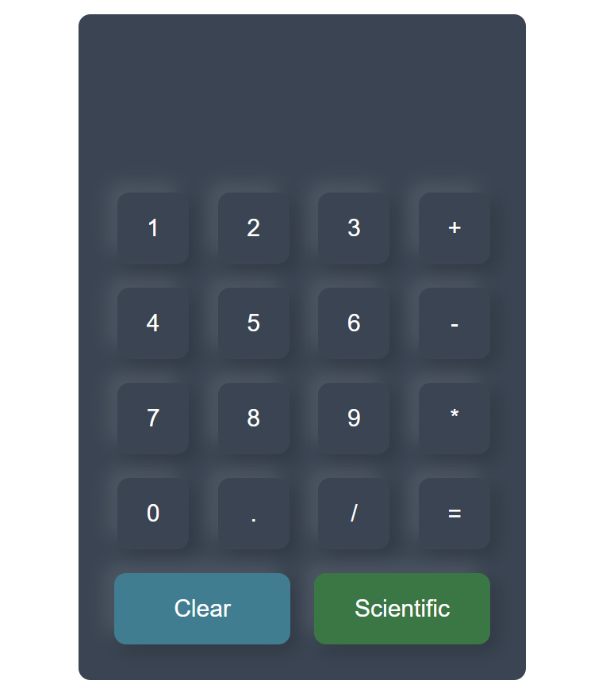

# Calculadora

Este é um projeto de calculadora simples desenvolvido utilizando HTML, CSS e JavaScript.

## Como Usar

Para usar a calculadora, siga estas etapas:

1. Clone este repositório ou baixe o arquivo ZIP.
2. Abra o arquivo `index.html` em qualquer navegador web moderno.
3. Use os botões numéricos para inserir números no display.
4. Utilize os botões de operações para adicionar operadores matemáticos (+, -, *, /) ao display.
5. Clique no botão "Clear" para limpar o display.
6. Ao clicar no botão de igual (=), a calculadora realizará a operação matemática e mostrará o resultado no display.

## Funcionalidades

- Adição, subtração, multiplicação e divisão de números.
- Funções científicas como seno, cosseno, tangente, logaritmo, exponencial e π.
- Limpeza do display.
- Visualização e ocultação das funções científicas.

## Desenvolvimento

- A interface da calculadora foi criada utilizando HTML e estilizada com CSS.
- A lógica de cálculo e funcionalidades foram implementadas utilizando JavaScript.

## Autor

Este projeto foi desenvolvido por João Jordão.

## Imagem

